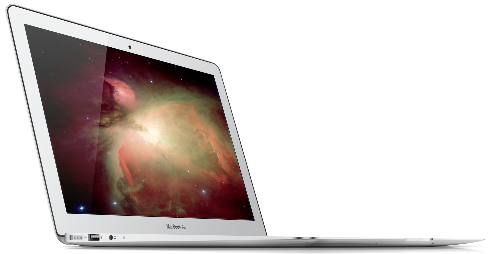
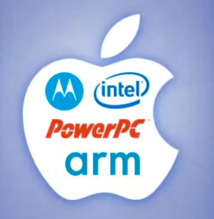
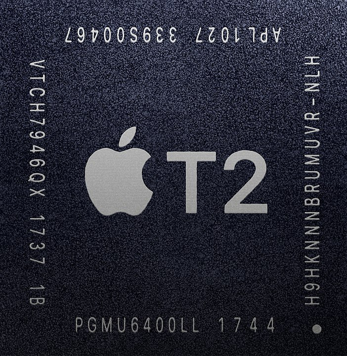
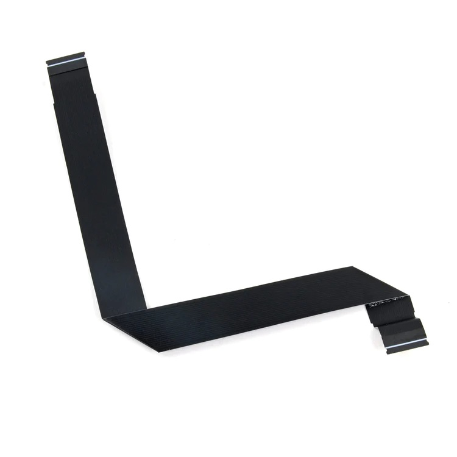
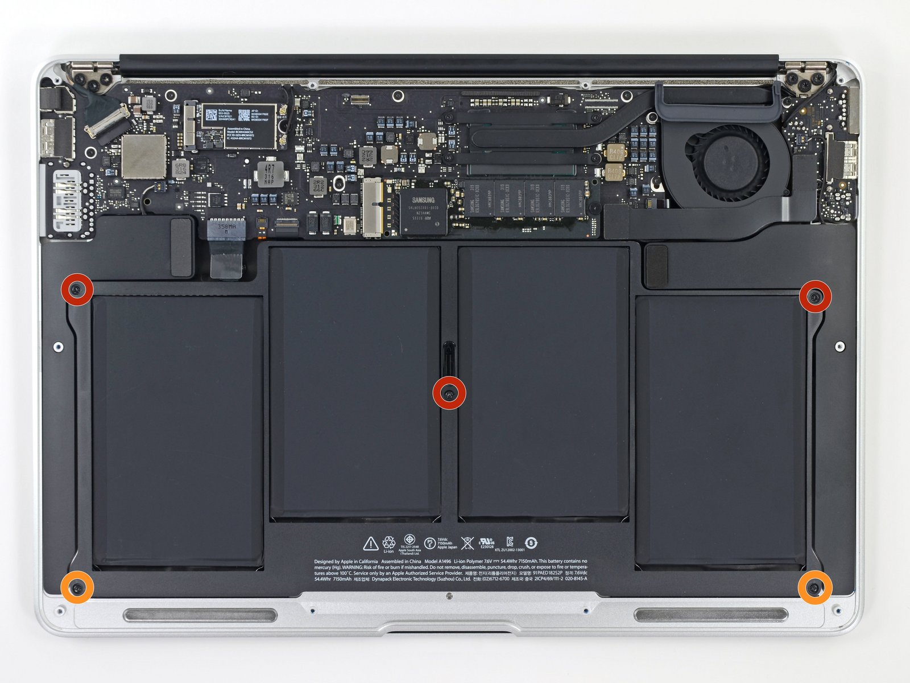
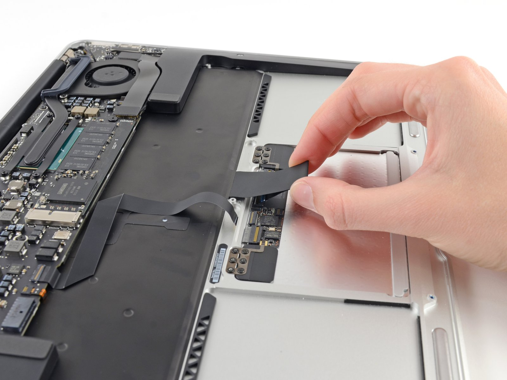
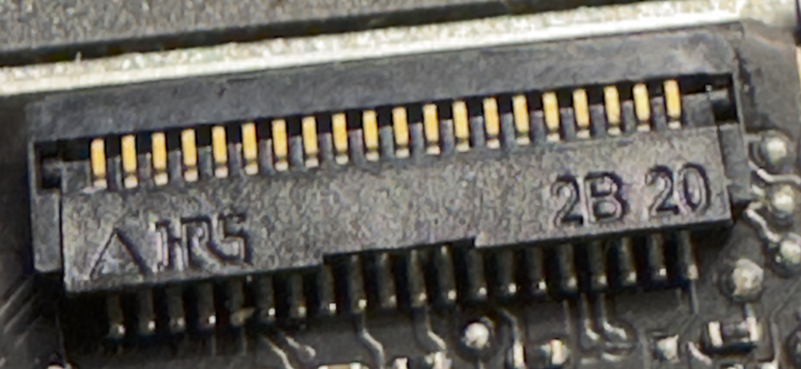
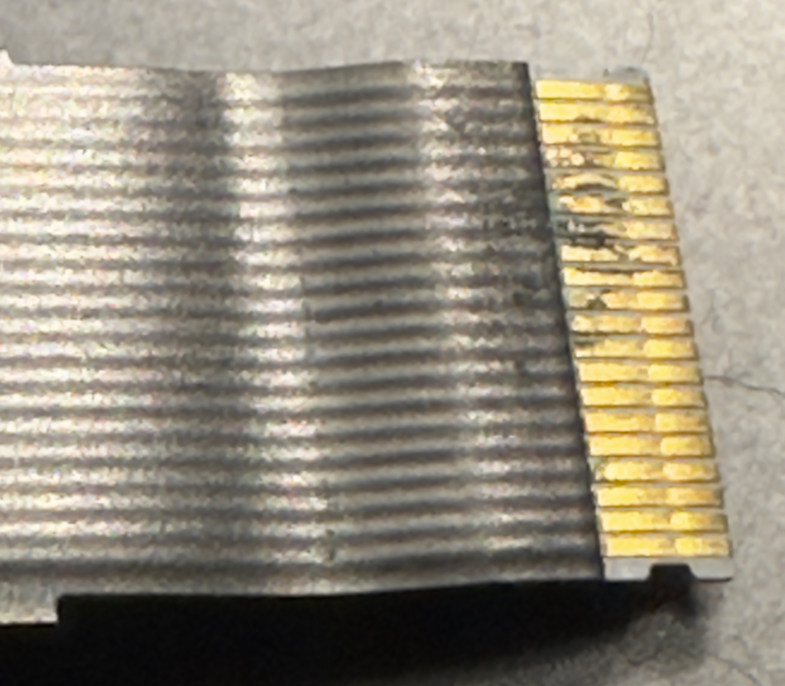
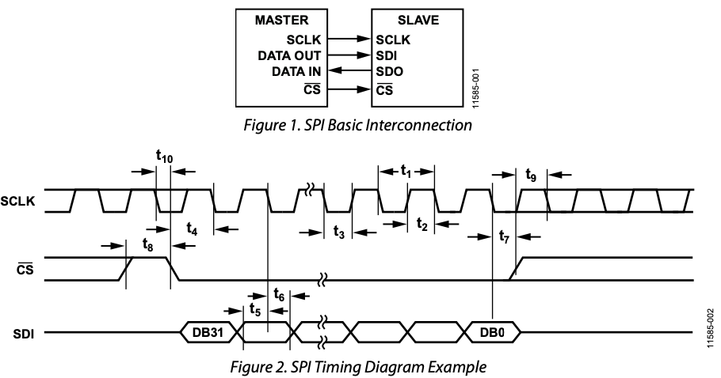

## What To Do with a Stolen Laptop

**Andrew Temme**

20 September 2023

How I came to own a stolen laptop,
its troubles, and the exploration of a MacBook Air's input system.

---

## Stolen Goods

Bought laptop after it was returned to friend

Notes:

- Excuse typos
  - MIT story of Ramesh's signatue
- Tell story of how I got laptop

---

## Objectives

- Appreciate SPI buses
- Improve understanding of Apple design
- Troubleshoot hardware

---

## HW or SW

Notes:

GPS that we thouht was sw for sure

---

1. Read
2. Find Possible Causes
3. Rank by Impact
4. Backup
5. Attempt to Fix

---

## Simple -> Complex

1. Reboot
2. Update
3. SMC
4. PRAM/NVRAM
5. Disk Encryption
6. Re-install macOS

Notes:

- Apple eco system and system arch
- Tell you that so I can tell you this

---

## System Layers 🍰

Notes:

- Layers
- Understand arch to debug

---

Notes:

- [List of Mac models grouped by CPU type](https://en.wikipedia.org/wiki/List_of_Mac_models_grouped_by_CPU_type)
  - PowePC 32-bit 1994
  - Intel 2005
  - Apple silicon 2020 (computers)
  - A4 was 2010 Package on Package (PoP)
- [Apple Chips](https://en.wikipedia.org/wiki/Apple_silicon)
- [Image Source](https://www.howtogeek.com/677270/deja-vu-a-brief-history-of-every-mac-cpu-architecture/)

---

## 🔒 Security 🔒

Drives SMC and Touch ID

Notes:

- 2016
- [Mac computers with the Apple T2 Security Chip](https://support.apple.com/en-us/HT208862)
- [Hardware microphone disconnect](https://www.apple.com/mideast/mac/docs/Apple_T2_Security_Chip_Overview.pdf)
  - Mac portables with T2
  - hardware disconnect
  - disabled whenever the lid is closed
  - implemented in hardware alone
  - prevents even T2
  - camera is not disconnected since completely obstructed when closed

---

System Management Controller ([SMC]((https://support.apple.com/en-us/HT201295)))
manages power

Notes:

- **Important later because of batter issues**
- Battery isn't charging
- Mac isn't turning on
- Fans are running fast
- Mac laptop computer gets too warm
- Built-in camera isn't working

---

---

## NVRAM (PRAM)

Store system settings

Notes:

- such as sound volume, display resolution, startup-disk selection, and time zone
- [Reset NVRAM on your Mac](https://support.apple.com/en-us/HT204063)

---

## More Key Combinations

| Key | Result |
| -- | -- |
| ⌘-R | Recovery mode |
| ⌥-⌘-R | Internet recovery mode |
| ⇧-⌥-⌘-R | Internet recovery mode |
| ⌥-⌘-P-R | Reset NVRAM |
| D | Diagnostics |
| ⌘-V | Verbose mode |

Notes:

- [Startup key combntions](https://support.apple.com/en-us/102603)

---

## Boot Process

- UEFI
- macOS booter
- kernel

Notes:

- Unified Extensible Firmware Interface (UEFi)

---

## Where Does That Leave Me?

| Level | Status |
| -- | -- | 
| UEFI | ✅ |
| macOS | ❌ |

Notes:

- Back to HW or SW

---

## We interrupt this broadcast...

What's the cost?

⌛️ 💰 📉 📚

Notes:

- time, money, and future productivity
- not receiving macOS upgrades

---

## Back to the Inter-webs

---

## Trackpad Cable

Notes:

- Risk selection
- Low cost

---

## More Studying

Notes:

- Time with son to learn
- iFixit image

---

Note:

- iFixIt image

---

Notes:

- Recognize the connector & Hirose

---

---

## 2 Insights

- SPI & USB
- Corrosion

---

Remember, it was stolen

---

1. Can I fix it?
2. Can I understand it?

---

Why SPI?

Notes:

- Thought I was suppose to be finding answers

---

---

## Why SPI

- Speed/bandwidth
- Power
- Simple

---

## What's Next

---

- Appreciate SPI buses
  - SPI makes Mac trackpads awesome
- Improve understanding of Apple design
  - Integration of hardware and software drives performance
- Troubleshoot hardware
  - Hardware or Software

Notes:

- Salute you
